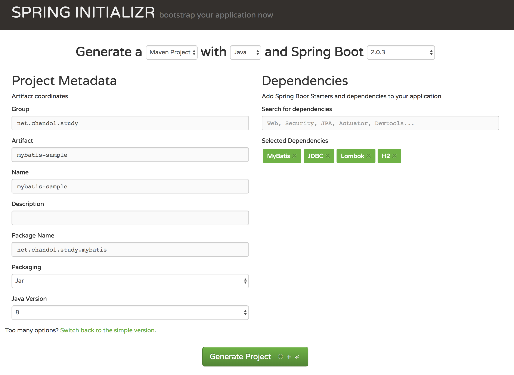

# Spring boot에 MyBatis 설정하기

스프링 프로젝트를 진행할때마다 DB와의 연동은 필수적으로 들어가게 된다. 최근에는(드디어) JPA를 이용해 프로젝트를 많이 진행하지만, 여전히 SQL을 이용한 직관적인 매핑방식도 많이 사용되고 있다.
단순한 프로젝트라면 SpringJdbc를 이용해서도 충분히 SQL을 구성할 수 있다. 하지만 실무환경에서는 다양한 경우의수가 발생하고 이에 따른 SQL도 함께 변경되어야 하고, 이러한 복잡한 SQL이 필요한 지점에서 MyBatis의 동적 SQL관리방법은 프로젝트의 복잡도를 줄이는데 큰 도움이 된다.

이번 포스팅에서는 spring boot를 이용하여 간단하게 MyBatis 샘플 프로젝트를 구성하는 법을 알아보고, 디버깅을 위한 SQL설정 및 확장하는 방법을 공유하고자 한다.


## 프로젝트 설정하기

### Spring Boot 프로젝트 생성하기  

MyBatis 라이브러리가 spring boot용으로 제공되고 있다. 이를 사용하면 간단하게 mybatis설정이 가능하다.

https://start.spring.io 에서 아래와 같이 프로젝트 뼈대를 만들어주자



생성된 프로젝트에서는 아래와 같이 pom.xml이 만들어진다.

```XML
<?xml version="1.0" encoding="UTF-8"?>
<project xmlns="http://maven.apache.org/POM/4.0.0" xmlns:xsi="http://www.w3.org/2001/XMLSchema-instance"
         xsi:schemaLocation="http://maven.apache.org/POM/4.0.0 http://maven.apache.org/xsd/maven-4.0.0.xsd">
    <modelVersion>4.0.0</modelVersion>

    <groupId>net.chndol.study</groupId>
    <artifactId>mybatis-sample</artifactId>
    <version>0.0.1-SNAPSHOT</version>
    <packaging>jar</packaging>

    <name>mybatis-sample</name>
    <description>Demo project for Spring Boot</description>

    <parent>
        <groupId>org.springframework.boot</groupId>
        <artifactId>spring-boot-starter-parent</artifactId>
        <version>2.0.3.RELEASE</version>
        <relativePath/> <!-- lookup parent from repository -->
    </parent>

    <properties>
        <project.build.sourceEncoding>UTF-8</project.build.sourceEncoding>
        <project.reporting.outputEncoding>UTF-8</project.reporting.outputEncoding>
        <java.version>1.8</java.version>
    </properties>

    <dependencies>
        <dependency>
            <groupId>org.mybatis.spring.boot</groupId>
            <artifactId>mybatis-spring-boot-starter</artifactId>
            <version>1.3.2</version>
        </dependency>

        <dependency>
            <groupId>com.h2database</groupId>
            <artifactId>h2</artifactId>
            <scope>runtime</scope>
        </dependency>
        <dependency>
            <groupId>org.springframework.boot</groupId>
            <artifactId>spring-boot-starter-test</artifactId>
            <scope>test</scope>
        </dependency>

        <dependency>
            <groupId>org.projectlombok</groupId>
            <artifactId>lombok</artifactId>
        </dependency>
    </dependencies>

    <build>
        
        <plugins>
            <plugin>
                <groupId>org.springframework.boot</groupId>
                <artifactId>spring-boot-maven-plugin</artifactId>
            </plugin>
        </plugins>
    </build>


</project>
```

* `mybatis-spring-boot-starter`를 통해서 MyBatis 의존관계가 들어가게 되며 Spring 관련 기본설정이 들어가게 된다.
* `h2`를 이용하였다. inmemory db로 애플리케이션이 동작하는 경우에만 동작하는 테스트용도 DB이다. 현재 프로젝트는 해당 라이브러리를 이용해 외부 디비 매핑없이 돌아가도록 설정하였다.


### H2 Datasource설정 및 DB테이블 구성하기

H2도 기존의 Database와 유사한방식으로 DB설정이 가능하다.

`main/resources/application.properties`에 아래와 같이 url, username, password를 설정하자.

```
spring.datasource.url=jdbc:h2:mem:test
spring.datasource.username=sa
spring.datasource.password=
spring.datasource.driver-class-name=org.h2.Driver
```

그리고 예제에 사용할 `City`라는 테이블을 만들어주도록 하자. 해당 테이블에는 `ID`, `NAME`(도시명), `COUNTRY`(국가), `POPULATION`(인구수) 컬럼을 가진다.

H2는 인메모리 DB로 애플리케이션이 동작하는 경우에만 DB가 함께 동작한다. Spring이 시작하는 시점에 scheme이 생성되도록 `/src/main/resource/scheme.sql`을 생성하여 주고 아래에 다음과 같이 table 생성 SQL과 예제데이터를 추가하여 주자.

```SQL
DROP TABLE IF EXISTS CITY;

CREATE TABLE CITY (ID INT PRIMARY KEY AUTO_INCREMENT, NAME VARCHAR, COUNTRY VARCHAR, POPULATION INT);

INSERT INTO CITY (NAME, COUNTRY, POPULATION) VALUES ('San Francisco', 'US', 10000);
INSERT INTO CITY (NAME, COUNTRY, POPULATION) VALUES ('서울', 'KR', 20000);
INSERT INTO CITY (NAME, COUNTRY, POPULATION) VALUES ('東京', 'JP', 30000);
INSERT INTO CITY (NAME, COUNTRY, POPULATION) VALUES ('부산', 'KR', 40000);
```

scheme.sql을 활용한 데이터베이스 초기화와 관련된 자세한 설정은 해당 [스프링 문서](https://docs.spring.io/spring-boot/docs/current/reference/html/howto-database-initialization.html#howto-initialize-a-database-using-spring-jdbc) 에서 확인할 수 있다. 


### MyBatis 설정하기

mapper를 스캔할 수 있도록 설정하자. SpringBoot Configuration 파일상단에 아래와 같이 프로젝트 패키지의 경로를 넣자. 이렇게 하여 프로젝트 하위에 존재하는 `Mapper`들을 빈으로 등록할수 있게 된다.

```Java
import org.mybatis.spring.annotation.MapperScan;

@SpringBootApplication
@MapperScan(basePackages = "net.chandol.study.mybatissample")
public class MybatisSampleApplication {
....
```

`main/resources/application.properties`에도 설정을 추가하자. type을 쉽게 쓰기 위해서 model 패키지를 type-aliaes에 설정하였다. 그리고 DB 로깅을 위해서 mapper 패키지로깅을 TRACE로 설정하였다.

```properties
# mybatis 매핑 type을 짧게 쓰기 위한 설정
mybatis.type-aliases-package=net.chndol.study.mybatissample.model

# mapper 이하를 로깅 위치로 설정.
logging.level.net.chndol.study.mybatissample.mapper=TRACE
```

프로젝트를 시작하는데 이정도면 충분히 쓸만할 것이다. spring boot starter로 설정된 mybatis를 사용하였으므로, 기본적으로 필요한 설정값들은 AutoConfigure를 통해서 자동으로 등록된다. mybatis와 연관된 좀 더 자세한 설정은 [여기](http://www.mybatis.org/spring-boot-starter/mybatis-spring-boot-autoconfigure/)를 참조하면 친절하게 안내되어있다.

## 코드 작성해보기

### Model, Mapper, XML 구성하기

이제 위에서 만들어놓은 `CITY`테이블과 매핑되는 model을 설정하여 보자

```Java
package net.chndol.study.mybatissample.model;

@Data
@Alias("city")
public class City {
    private Long id;
    private String name;
    private String country;
    private Long population;

    public City() {
    }

    public City(String name, String country, Long population) {
        this.name = name;
        this.country = country;
        this.population = population;
    }
}
```

그리고 해당 Model과 연결될 Mapper를 구성하여 주자.

우선 mapper interface는 아래와 같이 구성하자.

```Java
package net.chndol.study.mybatissample.repository;

import net.chndol.study.mybatissample.model.City;
import org.apache.ibatis.annotations.Mapper;

import java.util.List;

@Mapper
public interface CityMapper {
    City selectCityById(Long id);
    List<City> selectAllCity();
    void insertCity(City city);
}
```

그리고 SQL을 가진 핵심 XML은 아래와 같이 만들어 주자.
해당 파일을 resource 하위에 mapper 인터페이스와 동일한 패키지 경로 하위에 넣으면 된다.

```XML
<?xml version="1.0" encoding="UTF-8"?>

<!DOCTYPE mapper PUBLIC "-//mybatis.org//DTD Mapper 3.0//EN"
        "http://mybatis.org/dtd/mybatis-3-mapper.dtd">

<mapper namespace="net.chndol.study.mybatissample.repository.CityMapper">

    <select id="selectCityById" resultType="city">
        SELECT ID
              ,NAME
              ,COUNTRY
              ,POPULATION
          FROM CITY
         WHERE ID = #{id}
    </select>

    <select id="selectAllCity" resultType="city">
        SELECT ID
              ,NAME
              ,COUNTRY
              ,POPULATION
          FROM CITY
    </select>

    <insert id="insertCity">
      INSERT INTO CITY (NAME, COUNTRY, POPULATION)
      VALUES (#{name}, #{country}, #{population})
    </insert>

</mapper>
```

MyBatis는 이외에도 mapper annotation을 이용해 SQL문을 지정할 수 있다.
하지만 MyBatis를 이용하는 가장 큰 이유중 하나인 XML을 기반으로 SQL을 깔끔하게 관리할 수 있다는 장점이 없어지는것 같아서 개인적으로 선호하지는 않는다.
해당 방식에 대한 코드는 [여기](https://github.com/mybatis/spring-boot-starter/tree/master/mybatis-spring-boot-samples)를 참고하라.

그리고 마지막으로 service와 test를 만들어보자.

```Java
@Service
@Transactional
public class CityService {
    @Autowired
    CityMapper cityMapper;

    public City getCityById(Long id) {
        return cityMapper.selectCityById(id);
    }

    public List<City> getAllCity() {
        return cityMapper.selectAllCity();
    }

    public void addCity(City city) {
        cityMapper.insertCity(city);
    }
}
```

```Java
@Slf4j
@SpringBootTest
@RunWith(SpringRunner.class)
@Transactional
public class CityServiceTest {
    @Autowired
    CityService service;

    @Test
    public void getCityById() {
        City city = service.getCityById(1L);
        log.info("city : {}", city);
    }

    @Test
    public void getAllCity() {
        List<City> cities = service.getAllCity();
        log.info("cities : {}", cities);
    }


    @Test
    public void addCities() {
        service.addCity(new City("뉴욕", "미국", 1_000_000L));
        service.addCity(new City("런던", "영국", 2_000_000L));
        service.addCity(new City("파리", "프랑스", 3_000_000L));
    }

}
```

해당 테스트를 실행시켜보면 아래와 같이 로그를 볼 수 있다. SQL이 어떻게 동작했는지, paramter가 무엇인지를 확인할 수 있다.

```Properties
2018-07-30 12:21:44.371 DEBUG 25521 --- [           main] n.c.s.m.m.CityMapper.selectCityById      : ==>  Preparing: SELECT ID ,NAME ,COUNTRY ,POPULATION FROM CITY WHERE ID = ? 
2018-07-30 12:21:44.390 DEBUG 25521 --- [           main] n.c.s.m.m.CityMapper.selectCityById      : ==> Parameters: 1(Long)
2018-07-30 12:21:44.407 TRACE 25521 --- [           main] n.c.s.m.m.CityMapper.selectCityById      : <==    Columns: ID, NAME, COUNTRY, POPULATION
2018-07-30 12:21:44.408 TRACE 25521 --- [           main] n.c.s.m.m.CityMapper.selectCityById      : <==        Row: 1, San Francisco, US, 10000
2018-07-30 12:21:44.412 DEBUG 25521 --- [           main] n.c.s.m.m.CityMapper.selectCityById      : <==      Total: 1
2018-07-30 12:21:44.413  INFO 25521 --- [           main] n.c.s.m.service.CityServiceTest          : city : City(id=1, name=San Francisco, country=US, population=10000)
2018-07-30 12:21:44.416  INFO 25521 --- [           main] o.s.t.c.transaction.TransactionContext   : Rolled back transaction for test: 
```

## 한걸음더!

### XML파일과 interface 하나의 폴더에서 관리하기

MyBatis를 이용할 경우 전통적(?)으로 XML을 통해서 SQL문을 설정한다. 하지만 Java코드와 xml파일이 1:1로 매핑됨에도 불구하고, 폴더가 서로 다른곳에 위치해 둘을 서로 확인하기엔 불편하다. 이슈가 발생할때마다 . mapper interface 와 같은 폴더안에 있으면 보다 더 관리하기 편리할 것이다.

하지만 xml파일을 java와 같은 폴더로 옮기더라도 메이븐 빌드타임에 java파일을 제외한 다른 파일들은 예외로 설정되어 빌드경로로 파일을 옮기지 않는다. 때문에 빌드시 xml파일도 같이 복사될 수 있도록 메이븐 설정이 필요하다. 아래처럼 build 태그 하위에 resources 설정을 추가하여 주자. 

```XML
<projec>
    ...    

    <build>
        <resources>
            <resource>
                <filtering>false</filtering>
                <directory>src/main/java</directory>
                <includes>
                    <include>**/*.xml</include>
                </includes>
            </resource>
            <resource>
                <directory>src/main/resources</directory>
            </resource>
        </resources>

        ...
    </build>


</project>
```

이제부터 xml과 interface를 하나의 폴더에서 관리가 가능하다!


### 로깅을 좀 더 친절하게

지금까지 해서 제법 쓸만한 설정들을 만들어놓았다. 개인적으로 mybatis를 이용할 때 불편했던 점은 동적 SQL로 변화하고 난 다음에 생성된 SQL과 파라미터와 매핑되는 부분이 "?"로 전부 치환된다는 점이였다. 해당 값들이 어떤 의미였는지를 알기 위해선 다시 한 번 xml파일을 통해 확인하여야 한다.

이러한 단점을 보완하기 위해서 출력되는 SQL의 ? 뒤에 매핑파라미터의 이름을 코멘트로 남겨보도록 하자. 이렇게 할 경우 문제가 생기더라도 빠르게 디버깅이 가능할 것이다.

MyBatis의 XML에서 설정한 동적 SQL문은 `XMLLanguageDriver`를 통해서 JDBC에사용될 SQL문으로 변경된다. 이러한 과정 중간에 SQL문을 꺼내 코멘트를 추가하여 보도록 하자.

```java
package net.chandol.study.mybatissample.config;

@Slf4j
public class EnhanceMybatisLanguageDriver extends XMLLanguageDriver {
    public EnhanceMybatisLanguageDriver() {
    }

    @Override
    public ParameterHandler createParameterHandler(MappedStatement mappedStatement, Object parameterObject, BoundSql boundSql) {
        addDebuggingComment(boundSql);
        return super.createParameterHandler(mappedStatement, parameterObject, boundSql);
    }

    @Override
    public SqlSource createSqlSource(Configuration configuration, XNode script, Class<?> parameterType) {
        return super.createSqlSource(configuration, script, parameterType);
    }

    @Override
    public SqlSource createSqlSource(Configuration configuration, String script, Class<?> parameterType) {
        return super.createSqlSource(configuration, script, parameterType);
    }

    @SneakyThrows
    private void addDebuggingComment(BoundSql boundSql) {
        Field sqlField = BoundSql.class.getDeclaredField("sql");
        sqlField.setAccessible(true);

        String sql = (String) sqlField.get(boundSql);
        List<ParameterMapping> parameterMappings = boundSql.getParameterMappings();
        sql = addParameterComment(sql, parameterMappings);

        sqlField.set(boundSql, sql);
    }

    private String addParameterComment(String sql, List<ParameterMapping> parameters) {
        StringBuilder sqlInternalStringBuilder = new StringBuilder(sql);

        int paramReverseIndex = parameters.size() - 1;
        for (int idx = sql.length() - 1; idx > 0; idx--) {
            char c = sql.charAt(idx);
            if (c == '?') {
                String commentedString = toCommentString(parameters.get(paramReverseIndex).getProperty());

                sqlInternalStringBuilder.insert(idx + 1, commentedString);
                paramReverseIndex = paramReverseIndex - 1;
            }
        }

        return sqlInternalStringBuilder.toString();
    }

    private String toCommentString(String comment) {
        return " /*" + comment + "*/ ";
    }

}
```

`XMLLanguageDriver`를 새롭게 확장하여 코멘트를 추가하는 로직을 가진 `addDebuggingComment` 메서드를 매번 호출하도록 하였다. 해당 메서드는 리플렉션을 이용해 내부의 SQL문을 뽑아내었고, `addParameterComment`에서는 "?"의 위치를 찾아내어 paramter의 ID값을 매핑하도록 만들었다.

이렇게 새롭게 확장한 LanguageDriver는 아래와 같이 application.properties를 통해서 설정할 수 있다.

```properties
mybatis.configuration.default-scripting-language=net.chandol.study.mybatissample.config.EnhanceMybatisLanguageDriver
```

이제 테스트를 돌려보면 다음과 같이 "?" 뒤에 코멘트가 추가되어 어떤 파라미터와 매핑되었는지를 확인할 수 있을 것이다.

```log
2018-07-30 23:17:06.718 DEBUG 29739 --- [           main] n.c.s.m.mapper.CityMapper.insertCity     : ==>  Preparing: INSERT INTO CITY (NAME, COUNTRY, POPULATION) VALUES (? /*name*/ , ? /*country*/ , ? /*population*/ ) 
2018-07-30 23:17:06.738 DEBUG 29739 --- [           main] n.c.s.m.mapper.CityMapper.insertCity     : ==> Parameters: 뉴욕(String), 미국(String), 1000000(Long)
2018-07-30 23:17:06.738 DEBUG 29739 --- [           main] n.c.s.m.mapper.CityMapper.insertCity     : <==    Updates: 1
2018-07-30 23:17:06.738 DEBUG 29739 --- [           main] n.c.s.m.mapper.CityMapper.insertCity     : ==>  Preparing: INSERT INTO CITY (NAME, COUNTRY, POPULATION) VALUES (? /*name*/ , ? /*country*/ , ? /*population*/ ) 
2018-07-30 23:17:06.739 DEBUG 29739 --- [           main] n.c.s.m.mapper.CityMapper.insertCity     : ==> Parameters: 런던(String), 영국(String), 2000000(Long)
2018-07-30 23:17:06.739 DEBUG 29739 --- [           main] n.c.s.m.mapper.CityMapper.insertCity     : <==    Updates: 1
```

## 맺음

위의 동작하는, 설정된 코드는 아래 github 저장소에서 찾아볼 수 있다.

https://github.com/JAVACAFE-STUDY/mybatis-sample